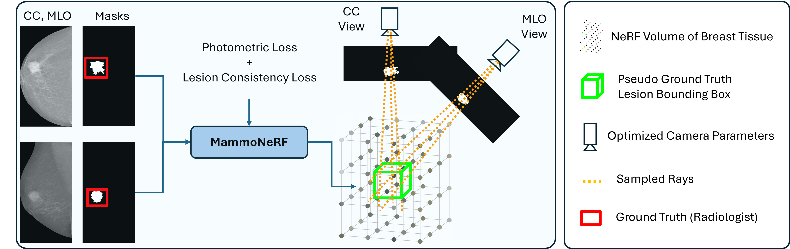
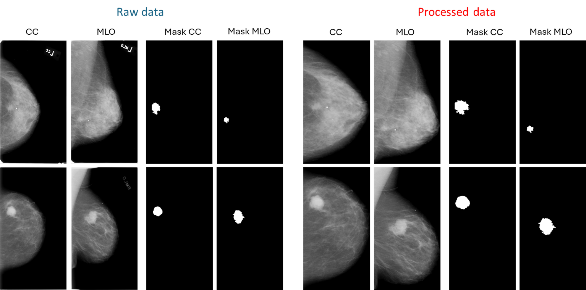
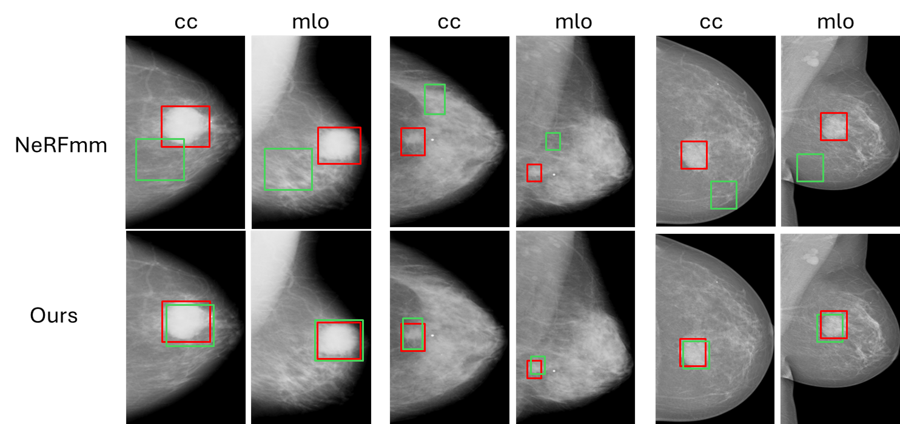

# MammoNeRF:  Neural Radiance Fields for Mammography Imaging

A novel approach for 3D reconstruction of breast tissue using Neural Radiance Fields(NeRF).

### Introduction

We propose a novel approach for reconstructing a 3D volumetric representation of breast tissue from 2D mammograms (CC and MLO). 
MammoNeRF is trained CC and MLO views annotated with the corresponding binary lesion masks. To enforce cross-view alignment, we introduce a lesion consistency loss in addition to the photometric loss, encouraging the model to estimate consistent poses across both views. This enables the reconstruction of pseudo ground-truth 3D lesion bounding boxes (3DPB) and 3D volumetric breast representations. Without this constraint, traditional NeRF models tend to reconstruct the same lesion at inconsistent spatial locations across views, resulting in incoherent lesion geometry. MammoNeRF jointly optimizes NeRF parameters, camera poses, and lesion centroids within a unified framework.

### Architecture
<p align="center">  <p align="center">  

### Coordinate System
The initial camera origin for the CC view is placed at the origin and oriented to look in the negative y-direction. The MLO view is initialized by rotating the CC view by 45 degrees around the y-axis.
<div align="center">
<p align="center">  
</div>

&nbsp;

## 1. Create Environment:
We provide a  `environment.yml` file to set up a `conda` environment:       

```sh
git clone https://github.com/yass123am/MammoNeRF.github.io.git
cd MammoNeRF
conda env create -f environment.yml
conda activate mammoNeRF
```

Our code should be able to run with any `pytorch >= 1.1` .

Install `open3d` for visualisation. You might need a physical monitor to install this lib.
```sh
pip install open3d
```
or the files are saved in PLY format, can you visualize them using 3D visualization software.

## Get Data

We conduct our experiments using the CBIS-DDSM and INbreast datasets. For each patient, both CC and MLO mammographic views are available, accompanied by corresponding binary lesion masks that serve as supervisory labels. 

<div align="center">
<p align="center">  
</div>

## Training

MammoNerF is trained from scratch
```sh
python tasks/any_folder/new_train.py \
    --scene_name='any_folder_demo/base'
```
### Render novel views
```sh
python tasks/any_folder/spiral.py \
    --scene_name='any_folder_demo/base' \
    --ckpt_dir='path/to/a/dir/contains/nerfmm/ckpts'
```

### Results

3D pseudo bounding-boxes results: Comparison between Ground truth bounding boxes (red) and the projection of
pseudo ground-truth 3D lesion bounding boxes (green) generated using learnable camera
parameters with MammNeRF and NeRFmm.
<div align="center">
<p align="center">  
</div>

Novel View Synthesis Results: Qualitative evaluation of novel view synthesis.
<div align="center">
<p align="center">  
</div>